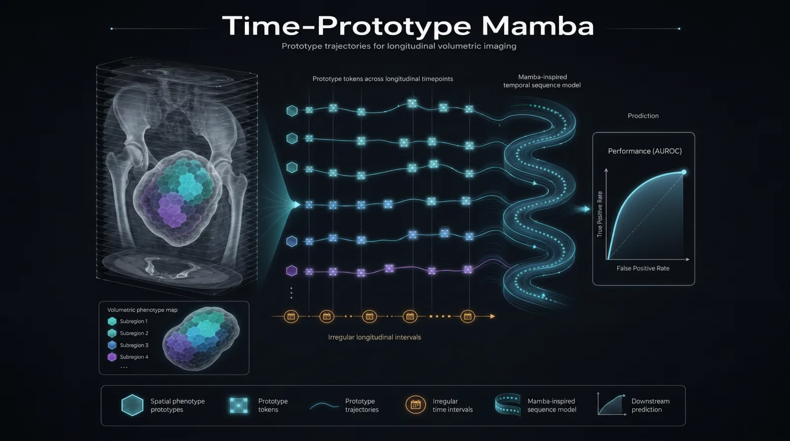

<!-- Time-Prototype Mamba -->

<div align="center">

<h1>Time-Prototype Mamba</h1>

<p><strong>Prototype-level temporal modeling for longitudinal volumetric imaging</strong></p>

<p>
  
</p>

<p>
  <a href="#citation"></a>
  <a href="https://www.python.org/"></a>
  <a href="https://pytorch.org/"></a>
  <a href="https://monai.io/"></a>
  <a href="https://github.com/state-spaces/mamba"></a>
  <a href="LICENSE"></a>
</p>

</div>

---

## Overview

**Time-Prototype Mamba (TPM)** is a compact research codebase for longitudinal volumetric imaging. It converts planning CT and serial follow-up scans into **prototype trajectories**, injects real acquisition timing, and uses a Mamba sequence block to predict a patient-level binary outcome.

This repository contains the public TPM implementation, including the model architecture, manifest-based dataset interface, training/evaluation scripts, and generated synthetic data for smoke testing.

> Manuscript status: under review.

---

## At a Glance

| Component | Design |
|---|---|
| Volumetric encoder | MONAI 3D UNet shared by planning CT and longitudinal scans |
| Regional abstraction | SLIC-style subregion pooling into learnable phenotype prototypes |
| Time representation | Dual-clock embedding with days from reference scan and days from previous scan |
| Sequence model | Strict Mamba encoder over prototype trajectories |
| Readout | Flattened prototype-time tokens fused with reference CT context |
| Test data | Generated synthetic longitudinal volumes for software validation |

```text
planning CT + serial scans
        |
        v
shared MONAI 3D UNet
        |
        v
SLIC-style subregion features -> learnable prototypes
        |
        v
dual-clock time embedding -> Mamba temporal encoder
        |
        v
patient-level binary prediction + interpretability tensors
```

---

## Highlights

- **Paper-aligned architecture**: the public TPM path uses `temporal_backend: mamba` and `strict_mamba: true`.
- **Prototype trajectories**: variable-count subregions are summarized into a fixed prototype bank for interpretable temporal modeling.
- **Real scan timing**: both absolute and interval day features are injected into the prototype sequence.
- **Manifest-first interface**: users can connect their own approved datasets without changing the model code.
- **Runnable smoke test**: a generated synthetic dataset is included to validate installation, training, checkpointing, and evaluation.

---

## Repository Layout

```text
time-prototype-mamba/
  assets/
    tpm_hero.webp
  configs/
    tpm_synthetic.yaml       # runnable smoke-test config
    tpm_full_template.yaml   # template for user-provided datasets
  data/
    synthetic/               # generated example arrays and manifests
  examples/
    make_synthetic_dataset.py
    train_synthetic.py
    evaluate_checkpoint.py
  tests/
    test_smoke.py
  time_prototype_mamba/
    data/                    # manifest dataset and synthetic generator
    models/                  # MONAI encoder, prototypes, Mamba, TPM model
    training/                # losses, metrics, train/evaluate helpers
    utils/                   # reproducibility utilities
```

---

## Installation

TPM targets Python 3.10-3.12 with a CUDA-enabled PyTorch stack compatible with Mamba-SSM. The smoke tests were verified with Python 3.12, PyTorch 2.9.1, MONAI 1.5.2, and Mamba-SSM 2.3.2.

Create the environment from this folder:

```bash
uv sync --extra dev
```

The default configs use the paper-aligned Mamba backend:

```yaml
temporal_backend: mamba
strict_mamba: true
```

---

## Quickstart

Generate the synthetic longitudinal dataset:

```bash
uv run python examples/make_synthetic_dataset.py --out data/synthetic --num-samples 24
```

Train the smoke model:

```bash
uv run python examples/train_synthetic.py --config configs/tpm_synthetic.yaml
```

Evaluate the best checkpoint:

```bash
uv run python examples/evaluate_checkpoint.py \
  --config configs/tpm_synthetic.yaml \
  --checkpoint outputs/synthetic_smoke/checkpoints/best.pt \
  --split val
```

Expected outputs:

```text
outputs/synthetic_smoke/
  config_resolved.yaml
  metrics.jsonl
  summary.json
  checkpoints/
    best.pt
    final.pt
```

---

## Data Interface

TPM uses a JSON manifest plus `.npz` arrays. A minimal record looks like this:

```json
{
  "case_id": "case_0001",
  "label": 1,
  "ct": "arrays/case_0001_ct.npz",
  "cbct": "arrays/case_0001_cbct.npz",
  "slic": "arrays/case_0001_slic.npz",
  "cbct_days_from_ct": [3, 7, 12, 18],
  "cbct_days_from_prev_cbct": [3, 4, 5, 6]
}
```

Expected array keys and shapes:

| File | Key | Shape |
|---|---|---|
| planning/reference CT | `ct` | `[1, D, H, W]` |
| longitudinal scans | `cbct` | `[T, 1, D, H, W]` |
| subregion labels | `slic` | `[1, D, H, W]` |

Labels are binary and use `1` as the positive class for `BCEWithLogitsLoss`. If your study uses the opposite convention, remap labels before writing the manifest.

---

## Data Availability

This repository includes generated synthetic data for software testing and example execution. The data that support the findings of the accompanying study are not publicly available because they contain sensitive patient information. Deidentified data may be made available by the corresponding authors upon reasonable request and subject to approval by the participating institutions and ethics committees after peer review.

---

## Training Objective

The public training loop uses:

```text
L = L_BCE
  + lambda_cluster * L_cluster
  + lambda_contrast * L_temporal_contrast
  + lambda_temporal_smooth * L_gap_smoothness
```

`L_cluster` regularizes the prototype bank. `L_temporal_contrast` encourages the same prototype to remain comparable between adjacent valid visits and supports class-dependent weights matching the manuscript configuration. `L_gap_smoothness` penalizes short-interval prototype jumps more strongly than long-interval changes.

The implementation also exposes an optional prototype diversity term, `lambda_diversity * L_diversity`, for studies that need stronger prototype-bank separation. It is disabled in the provided default configs.

---

## Programmatic Use

```python
from time_prototype_mamba import TimePrototypeMamba

model = TimePrototypeMamba(
    unet_features=[8, 16, 32],
    num_prototypes=24,
    classifier_max_timepoints=8,
    temporal_backend="mamba",
    strict_mamba=True,
)
```

During inference or visualization:

```python
out = model(
    ct=batch["ct"],
    cbct=batch["cbct"],
    cbct_valid_mask=batch["cbct_valid_mask"],
    slic=batch["slic"],
    cbct_days_from_ct=batch["cbct_days_from_ct"],
    cbct_days_from_prev_cbct=batch["cbct_days_from_prev_cbct"],
    return_interpretability=True,
)

logits = out["logits"]
attention = out["region_time_attention"]
prototype_tokens = out["temporal_tokens"]
```

---


## Citation

The accompanying manuscript is currently under review. Citation details will be updated after publication.
